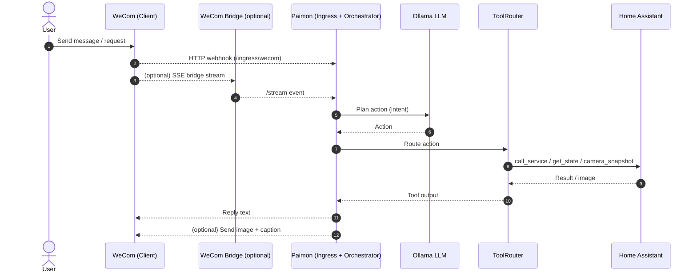

# Paimon (Phase 1)

Single-process monolith that processes ingress events in strict per-session order.

## Architecture (Sequence)



## Directory conventions

- `src/ingress`: inbound protocol adapters (`/ingress/*`, admin API, bridge stream).
- `src/integrations`: outbound integrations (Home Assistant, WeCom clients).
- `src/runtime-tools`: LLM-callable tools and registry.
- `src/storage`: persistence abstraction (`registerStore/getStore/setStore`).
- `tools/`: standalone operational scripts (not runtime modules).

See `AGENTS.md` for coding constraints and `docs/PROJECT_STRUCTURE.md` for structure planning.

## Requirements

- Node.js 18+

## Setup

```bash
npm install
```

Set Home Assistant env vars:

```bash
export HA_BASE_URL="http://homeassistant.local:8123"
export HA_TOKEN="YOUR_LONG_LIVED_TOKEN"
```

Set Ollama env vars:

```bash
export OLLAMA_BASE_URL="http://127.0.0.1:11434"
export OLLAMA_MODEL="qwen3:4b"
export OLLAMA_PLANNING_MODEL="qwen3:8b" # optional, used for skill planning stage; fallback to OLLAMA_MODEL
export OLLAMA_VISION_MODEL="qwen3-vl:4b" # optional, used for image describe
export LLM_TIMEOUT_MS="15000"
export LLM_PLANNING_TIMEOUT_MS="30000" # optional, fallback to LLM_TIMEOUT_MS
export LLM_MAX_RETRIES="2"
export LLM_STRICT_JSON="true"
export LLM_MAX_ITERATIONS="2"
export LLM_THINKING_BUDGET_ENABLED="false" # optional, enable planning thinking budget control
export LLM_THINKING_BUDGET="1024" # optional, admin default for Step2 planning; Step1 may override per request when enabled
export VISION_TIMEOUT_MS="30000"
export VISION_MAX_RETRIES="1"
export HA_SNAPSHOT_DESCRIBE="true"
export VISION_PROMPT="请用中文简短描述图片内容，1句话以内，不要臆测或编造。"
```

`LLM_THINKING_BUDGET_ENABLED=true` 时，Admin 中的 `LLM_THINKING_BUDGET` 表示 Planning Thinking Budget 默认值（供 Step1 LLM 参考）；Step2 实际执行可被 Step1 决策输出覆盖。

Set WeCom env vars:

```bash
export WECOM_TOKEN="YOUR_WECOM_TOKEN"
export WECOM_BRIDGE_URL="http://your-vps-domain:8080" # optional, for SSE bridge
export WECOM_BRIDGE_TOKEN="YOUR_STREAM_TOKEN" # optional, for SSE bridge
export WECOM_CORP_ID="YOUR_CORP_ID" # app message sender (local)
export WECOM_APP_SECRET="YOUR_APP_SECRET" # app message sender (local)
export WECOM_AGENT_ID="YOUR_AGENT_ID" # app message sender (local)
export WECOM_CONTEXT_LIMIT="1000" # max in-memory contexts
export WECOM_AUDIO_DIR="data/wecom-audio" # local voice file directory
export WECOM_MEDIA_USE_BRIDGE="true" # prefer bridge proxy for media download
```

Set STT env vars:

```bash
export STT_PROVIDER="fast-whisper" # fast-whisper | mock
export STT_FAST_WHISPER_AUTO_INSTALL="true" # auto pip install on startup
export STT_FAST_WHISPER_PYTHON="python3"
export STT_FAST_WHISPER_SCRIPT="tools/fast-whisper-transcribe.py" # optional, custom script path
export STT_FAST_WHISPER_MODEL="small"
export STT_FAST_WHISPER_DEVICE="auto"
export STT_FAST_WHISPER_COMPUTE_TYPE="int8"
export STT_FAST_WHISPER_LANGUAGE="zh" # optional
export STT_FAST_WHISPER_BEAM_SIZE="1"
export STT_FAST_WHISPER_VAD_FILTER="true"
export STT_FAST_WHISPER_TIMEOUT_MS="180000"
```

`STT_PROVIDER=fast-whisper` 时，服务启动会在 `sttRuntime.init()` 阶段检查 `faster_whisper` Python 包；如果缺失且 `STT_FAST_WHISPER_AUTO_INSTALL=true`，会自动执行：

```bash
python3 -m pip install --disable-pip-version-check faster-whisper
```

如果你想关闭自动安装，可设置 `STT_FAST_WHISPER_AUTO_INSTALL=false`，然后自行安装上述依赖。

HA entity allowlist is pulled from Home Assistant periodically via WebSocket (by `HA_BASE_URL` + `HA_TOKEN`), and filtered to those exposed to Assist (`options.conversation.should_expose = true`).
Because some camera entities lack `unique_id` and don’t appear in the entity registry, we also supplement `camera.*` from REST `/api/states`.
You can control refresh cadence with:

```bash
export HA_ENTITY_REFRESH_MS="60000"
```

## Run

```bash
npm run dev
```

## External scripts

All standalone helper scripts and bridge programs are under `tools/`:

- `tools/fast-whisper-transcribe.py`
- `tools/market-smoke.ts`
- `tools/wecom-bridge.go`
- `tools/wecom-bridge.js`

See `tools/README.md` for details.

## Health / sessions

```bash
curl -s http://localhost:3000/health
curl -s http://localhost:3000/sessions
```

## Admin config example

```bash
curl -s http://localhost:3000/admin/api/config
```

```json
{
  "model": "qwen3:4b",
  "planningModel": "qwen3:8b",
  "planningTimeoutMs": "30000",
  "thinkingBudgetEnabled": true,
  "thinkingBudgetDefault": "1024",
  "thinkingBudget": "1024"
}
```

## WeCom ingress

WeCom will POST XML to `/ingress/wecom` in plaintext mode. The adapter validates `signature` or `msg_signature` using `WECOM_TOKEN`, builds an `Envelope`, and returns a text reply.

For `voice` messages, the service will:

1. Download media by `MediaId` and save it under `WECOM_AUDIO_DIR` (default `data/wecom-audio`).
2. Run STT through the configured provider (`fast-whisper` by default).
3. Feed transcription text into orchestration and reply as normal.

## Camera snapshot describe

When `ha.camera_snapshot` is called, the agent will:

1. Fetch the image from Home Assistant.
2. Send the image to WeCom (bridge mode).
3. Use the vision model to generate a short caption and reply with that caption.

Set `HA_SNAPSHOT_DESCRIBE="false"` to disable the caption step. `OLLAMA_VISION_MODEL` falls back to `OLLAMA_MODEL` if not set.

## Curl examples

Reminder (MockTool):

```bash
curl -s http://localhost:3000/ingress \
  -H "Content-Type: application/json" \
  -d '{
    "requestId": "r1",
    "source": "http",
    "sessionId": "s1",
    "kind": "text",
    "text": "remind me tomorrow",
    "receivedAt": "2026-01-30T00:00:00Z"
  }'
```

Home Assistant call_service (turn on light):

```bash
curl -s http://localhost:3000/ingress \
  -H "Content-Type: application/json" \
  -d '{
    "requestId": "r2",
    "source": "http",
    "sessionId": "s1",
    "kind": "text",
    "text": "turn on the light",
    "receivedAt": "2026-01-30T00:00:00Z"
  }'
```

Home Assistant get_state:

```bash
curl -s http://localhost:3000/ingress \
  -H "Content-Type: application/json" \
  -d '{
    "requestId": "r3",
    "source": "http",
    "sessionId": "s1",
    "kind": "text",
    "text": "status of the light",
    "receivedAt": "2026-01-30T00:00:00Z"
  }'
```

## Notes

- Audit log is written to `data/audit.jsonl`.
- If HA entity list is empty (e.g., fetch failed), HA actions are rejected.

## WeCom bridge (no public ingress to local)

If you cannot expose your local service, run a small VPS bridge and connect via SSE.

VPS (Ubuntu 21, Go build + systemd):

```bash
sudo apt-get update
sudo apt-get install -y golang
cd /path/to/Paimon
go build -o wecom-bridge ./tools/wecom-bridge.go
```

Create env file (e.g. `/etc/wecom-bridge.env`):

```bash
WECOM_TOKEN=your_wecom_token
WECOM_AES_KEY=your_encoding_aes_key
WECOM_RECEIVE_ID=your_receive_id_optional
WECOM_BRIDGE_TOKEN=your_stream_token
BRIDGE_BUFFER_SIZE=200
PORT=8080
```

Systemd unit (silent run to avoid log noise):

```ini
[Unit]
Description=WeCom Bridge
After=network.target

[Service]
Type=simple
EnvironmentFile=/etc/wecom-bridge.env
WorkingDirectory=/path/to/Paimon
ExecStart=/path/to/Paimon/wecom-bridge
Restart=on-failure
RestartSec=2
StandardOutput=null
StandardError=null

[Install]
WantedBy=multi-user.target
```

Enable and start:

```bash
sudo systemctl daemon-reload
sudo systemctl enable wecom-bridge
sudo systemctl start wecom-bridge
```

Local (agent):

```bash
export WECOM_BRIDGE_URL="http://your-vps-domain:8080"
export WECOM_BRIDGE_TOKEN="your_stream_token"
```

## Session memory (MEMORY.MD)

Per-session memory is stored at `data/memory/<sessionId>/MEMORY.md` and injected into LLM runtime context as `memory`.

## Self-Improving Evolution Engine

Paimon now includes a built-in evolution loop for autonomous repo changes based on queued goals.

State stores (`json-file` backend):

- `evolution.state`
- `evolution.retry_queue`
- `evolution.metrics`

Core behavior:

- Tick loop (default every 30s): fetch pending goal or due retry.
- Plan via `codex exec --json`.
- Execute each plan step via codex.
- Run checks (`npm test` / `npm lint` / `tsc --noEmit`, based on available scripts).
- Auto-fix from check summary when failures occur.
- Exponential backoff retry for 429/rate-limit (`10m * 2^attempt`, max 6h).
- Auto commit after checks pass.
- Auto push after commit succeeds (to configured remote/branch or current upstream).
- Push failure marks goal as failed and enters existing failure/retry flow.
- Update metrics and goal events.

Admin APIs:

- `GET /admin/api/evolution/state`
- `POST /admin/api/evolution/goals`
- `POST /admin/api/evolution/tick`

WeCom / HTTP direct commands:

- `/evolve <goal>`
- `/coding <goal>`
- `/evolve status`
- `/evolve status <goalId>`
- `/evolve tick`

Example:

```bash
curl -s http://localhost:3000/admin/api/evolution/goals \
  -H "Content-Type: application/json" \
  -d '{
    "goal": "增加一个插件系统，支持动态加载工具模块",
    "commitMessage": "feat: add dynamic plugin loader"
  }'
```

Optional env:

- `EVOLUTION_TICK_MS` (default `30000`)
- `EVOLUTION_MAX_FIX_ATTEMPTS` (default `2`)
- `EVOLUTION_MAX_RETRY_ATTEMPTS` (default `6`)
- `EVOLUTION_RETRY_BASE_MS` (default `600000`)
- `EVOLUTION_RETRY_MAX_MS` (default `21600000`)
- `EVOLUTION_ENABLE_HARD_ROLLBACK` (default `false`)
- `EVOLUTION_GIT_PUSH_REMOTE` (optional, higher priority than git upstream)
- `EVOLUTION_GIT_PUSH_BRANCH` (optional, higher priority than git upstream)

Commit message rule:

- If request payload includes `commitMessage`, engine uses it as-is.
- If `commitMessage` is not provided, engine generates one from staged diff before commit.
- If generation fails, engine falls back to a deterministic message.

## Skills (extensible)

Create a skill under `skills/<name>/SKILL.md`.

Layering rules:

- Keep integration adapters flat under `src/integrations/<domain>/`.
- Keep all LLM-callable tool implementations in `src/runtime-tools/` (one tool per file, self-register).
- Keep `src/skills/` focused on skill metadata management.

Example structure:

```
skills/my-skill/SKILL.md
src/integrations/my-integration/client.ts
src/runtime-tools/mySkillTool.ts
```

In `SKILL.md`, define runtime contract fields:

- `runtime_tool`
- `runtime_action`
- `runtime_params`

And describe LLM output JSON as:

```json
{
  "tool": "runtime_tool_name",
  "action": "runtime_action_name",
  "params": {
    "key": "value"
  }
}
```

Runtime parser accepts both `action/params` and legacy `op/args`, then routes to the registered tool.

## Market Analysis Capability

`market-analysis` skill is built in and supports deterministic A-share/ETF/fund analysis.

When LLM explanation is enabled, the input `signalResult` sent to LLM includes both 股票代码+名称 via `assetSignals[].code` and `assetSignals[].name`.
For `analysisEngine: gpt_plugin`, the returned `summary` explicitly cites the data basis behind each signal conclusion (including benchmark context, per-asset code/name/signal, key available metrics, and missing data when unavailable).
To keep `chatgpt-bridge` stable, the prompt is still assembled with the existing string-array + `join(\"\")` pattern and does not introduce extra newline characters.

Direct commands:

```bash
/market midday
/market close
/market status
/market portfolio
```

Data files:

- Portfolio: `data/market-analysis/portfolio.json`
- Analysis config: `data/market-analysis/config.json`
- Run snapshots: `data/market-analysis/runs/*.json`
- Run index: `data/market-analysis/state.json`

Portfolio schema:

```json
{
  "funds": [
    {
      "code": "510300",
      "name": "沪深300ETF",
      "quantity": 1000,
      "avgCost": 3.85
    }
  ],
  "cash": 12000
}
```

Analysis engine config schema:

```json
{
  "version": 1,
  "analysisEngine": "local",
  "gptPlugin": {
    "timeoutMs": 20000,
    "fallbackToLocal": true
  }
}
```

Switch example (`local` -> `gpt_plugin`):

```bash
curl -s http://localhost:3000/admin/api/market/config \
  -H "Content-Type: application/json" \
  -X PUT \
  -d '{
    "analysisConfig": {
      "analysisEngine": "gpt_plugin",
      "gptPlugin": {
        "timeoutMs": 20000,
        "fallbackToLocal": true
      }
    }
  }'
```

Recommended scheduler setup (daily):

- `13:30` with message `/market midday`
- `15:15` with message `/market close`

Admin API:

- `GET /admin/api/market/config`
- `PUT /admin/api/market/config`
- `GET /admin/api/market/runs?limit=12`
- `GET /admin/api/market/runs/latest`
- `POST /admin/api/market/run-once`
- `POST /admin/api/market/tasks/bootstrap` (upsert two daily market tasks for a user)

Admin Market holdings editing:

- Portfolio rows in Admin Market are saved per-row. After editing one holding, click that row's save action to persist the change.
- Row status indicates whether the holding is unsaved, saving, or saved.
- Holding `name` is persisted together with `code`, `quantity`, and `avgCost`.
- `GET /admin/api/market/config` returns holding names at `portfolio.funds[].name`.

`POST /admin/api/market/run-once` (manual one-off run):

- Request body fields:
- `userId` (string, required): target receiver user id.
- `phase` (`midday` | `close`, required): generate intraday or close report.
- `withExplanation` (boolean, optional): when `false`, append `--no-llm` to skip LLM explanation.
- Only `userId`, `phase`, `withExplanation` are accepted. Any extra field returns `400`.

Request example:

```bash
curl -s http://localhost:3000/admin/api/market/run-once \
  -H "Content-Type: application/json" \
  -d '{
    "userId": "zhangsan",
    "phase": "midday",
    "withExplanation": true
  }'
```

Typical success response:

```json
{
  "ok": true,
  "phase": "midday",
  "message": "/market midday",
  "acceptedAsync": false,
  "responseText": "已生成盘中报告",
  "imageCount": 1
}
```

Typical async accepted response:

```json
{
  "ok": true,
  "phase": "close",
  "message": "/market close --no-llm",
  "acceptedAsync": true,
  "responseText": "任务已受理，稍后推送",
  "imageCount": 0
}
```

Typical `400` responses:

```json
{ "ok": false, "error": "userId is required" }
```

```json
{ "ok": false, "error": "phase must be midday or close" }
```

Relation with scheduled tasks:

- `run-once` triggers an immediate single execution and does not create/update cron tasks.
- Scheduled daily execution still uses `/admin/api/market/tasks/bootstrap` and task settings.

Manual one-off report generation:

1. Confirm target `userId` exists and can receive messages.
2. Trigger intraday run:

```bash
curl -s http://localhost:3000/admin/api/market/run-once \
  -H "Content-Type: application/json" \
  -d '{"userId":"zhangsan","phase":"midday","withExplanation":true}'
```

3. Trigger close run (without LLM explanation):

```bash
curl -s http://localhost:3000/admin/api/market/run-once \
  -H "Content-Type: application/json" \
  -d '{"userId":"zhangsan","phase":"close","withExplanation":false}'
```

4. Verify latest run record:

```bash
curl -s "http://localhost:3000/admin/api/market/runs/latest?phase=midday"
curl -s "http://localhost:3000/admin/api/market/runs/latest?phase=close"
```
