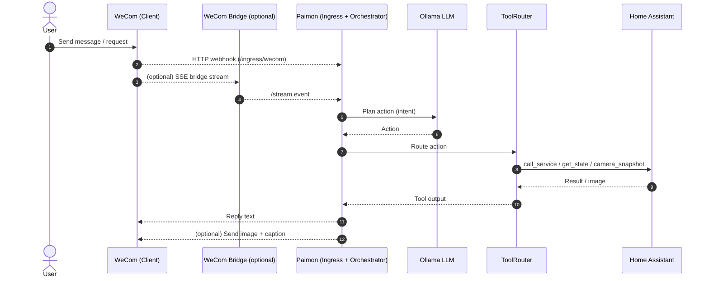

# Paimon (Phase 1)

Single-process monolith that processes ingress events in strict per-session order.

## Architecture (Sequence)



## Requirements

- Node.js 18+

## Setup

```bash
npm install
```

Set Home Assistant env vars:

```bash
export HA_BASE_URL="http://homeassistant.local:8123"
export HA_TOKEN="YOUR_LONG_LIVED_TOKEN"
```

Set Ollama env vars:

```bash
export OLLAMA_BASE_URL="http://127.0.0.1:11434"
export OLLAMA_MODEL="qwen3:4b"
export OLLAMA_PLANNING_MODEL="qwen3:8b" # optional, used for skill planning stage; fallback to OLLAMA_MODEL
export OLLAMA_VISION_MODEL="qwen3-vl:4b" # optional, used for image describe
export LLM_TIMEOUT_MS="15000"
export LLM_PLANNING_TIMEOUT_MS="30000" # optional, fallback to LLM_TIMEOUT_MS
export LLM_MAX_RETRIES="2"
export LLM_STRICT_JSON="true"
export LLM_MAX_ITERATIONS="2"
export VISION_TIMEOUT_MS="30000"
export VISION_MAX_RETRIES="1"
export HA_SNAPSHOT_DESCRIBE="true"
export VISION_PROMPT="请用中文简短描述图片内容，1句话以内，不要臆测或编造。"
```

Set WeCom env vars:

```bash
export WECOM_TOKEN="YOUR_WECOM_TOKEN"
export WECOM_BRIDGE_URL="http://your-vps-domain:8080" # optional, for SSE bridge
export WECOM_BRIDGE_TOKEN="YOUR_STREAM_TOKEN" # optional, for SSE bridge
export WECOM_CORP_ID="YOUR_CORP_ID" # app message sender (local)
export WECOM_APP_SECRET="YOUR_APP_SECRET" # app message sender (local)
export WECOM_AGENT_ID="YOUR_AGENT_ID" # app message sender (local)
export WECOM_CONTEXT_LIMIT="1000" # max in-memory contexts
```

HA entity allowlist is pulled from Home Assistant periodically via WebSocket (by `HA_BASE_URL` + `HA_TOKEN`), and filtered to those exposed to Assist (`options.conversation.should_expose = true`).
Because some camera entities lack `unique_id` and don’t appear in the entity registry, we also supplement `camera.*` from REST `/api/states`.
You can control refresh cadence with:

```bash
export HA_ENTITY_REFRESH_MS="60000"
```

## Run

```bash
npm run dev
```

## Health / sessions

```bash
curl -s http://localhost:3000/health
curl -s http://localhost:3000/sessions
```

## WeCom ingress

WeCom will POST XML to `/ingress/wecom` in plaintext mode. The adapter validates `signature` or `msg_signature` using `WECOM_TOKEN`, builds an `Envelope`, and returns a text reply.

## Camera snapshot describe

When `ha.camera_snapshot` is called, the agent will:

1. Fetch the image from Home Assistant.
2. Send the image to WeCom (bridge mode).
3. Use the vision model to generate a short caption and reply with that caption.

Set `HA_SNAPSHOT_DESCRIBE="false"` to disable the caption step. `OLLAMA_VISION_MODEL` falls back to `OLLAMA_MODEL` if not set.

## Curl examples

Reminder (MockTool):

```bash
curl -s http://localhost:3000/ingress \
  -H "Content-Type: application/json" \
  -d '{
    "requestId": "r1",
    "source": "http",
    "sessionId": "s1",
    "kind": "text",
    "text": "remind me tomorrow",
    "receivedAt": "2026-01-30T00:00:00Z"
  }'
```

Home Assistant call_service (turn on light):

```bash
curl -s http://localhost:3000/ingress \
  -H "Content-Type: application/json" \
  -d '{
    "requestId": "r2",
    "source": "http",
    "sessionId": "s1",
    "kind": "text",
    "text": "turn on the light",
    "receivedAt": "2026-01-30T00:00:00Z"
  }'
```

Home Assistant get_state:

```bash
curl -s http://localhost:3000/ingress \
  -H "Content-Type: application/json" \
  -d '{
    "requestId": "r3",
    "source": "http",
    "sessionId": "s1",
    "kind": "text",
    "text": "status of the light",
    "receivedAt": "2026-01-30T00:00:00Z"
  }'
```

## Notes

- Audit log is written to `data/audit.jsonl`.
- If HA entity list is empty (e.g., fetch failed), HA actions are rejected.

## WeCom bridge (no public ingress to local)

If you cannot expose your local service, run a small VPS bridge and connect via SSE.

VPS (Ubuntu 21, Go build + systemd):

```bash
sudo apt-get update
sudo apt-get install -y golang
cd /path/to/Paimon
go build -o wecom-bridge ./tools/wecom-bridge.go
```

Create env file (e.g. `/etc/wecom-bridge.env`):

```bash
WECOM_TOKEN=your_wecom_token
WECOM_AES_KEY=your_encoding_aes_key
WECOM_RECEIVE_ID=your_receive_id_optional
WECOM_BRIDGE_TOKEN=your_stream_token
BRIDGE_BUFFER_SIZE=200
PORT=8080
```

Systemd unit (silent run to avoid log noise):

```ini
[Unit]
Description=WeCom Bridge
After=network.target

[Service]
Type=simple
EnvironmentFile=/etc/wecom-bridge.env
WorkingDirectory=/path/to/Paimon
ExecStart=/path/to/Paimon/wecom-bridge
Restart=on-failure
RestartSec=2
StandardOutput=null
StandardError=null

[Install]
WantedBy=multi-user.target
```

Enable and start:

```bash
sudo systemctl daemon-reload
sudo systemctl enable wecom-bridge
sudo systemctl start wecom-bridge
```

Local (agent):

```bash
export WECOM_BRIDGE_URL="http://your-vps-domain:8080"
export WECOM_BRIDGE_TOKEN="your_stream_token"
```

## Session memory (MEMORY.MD)

Per-session memory is stored at `data/memory/<sessionId>/MEMORY.md` and injected into LLM runtime context as `memory`.

## Skills (extensible)

Create a skill under `skills/<name>/SKILL.md`. Optionally add `skills/<name>/handler.js` exporting `execute(input, context)`.

Example structure:

```
skills/my-skill/SKILL.md
skills/my-skill/handler.js
```

LLM can call `skill.invoke` with `{ name, input }`.
